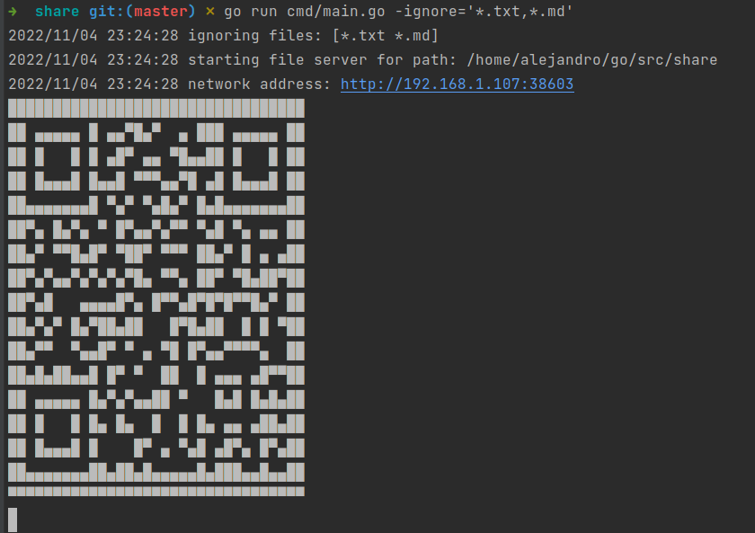

# Share files over local network

### Usage
After starting app, you can access files from your browser at provided url
```bash
# allow download all files in current directory
share

# allow download all files in specified directory
share -path=/path/to/directory

# allow download all files except specified files
share -ignore='*.txt,*.md'
```
